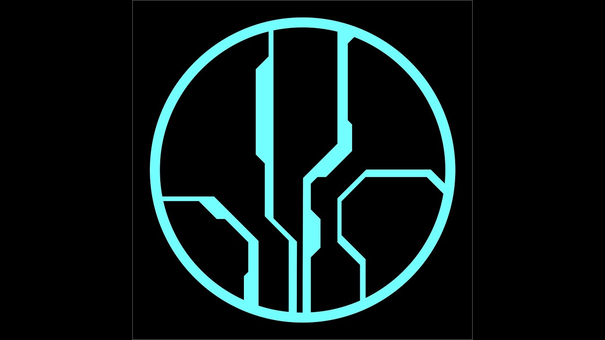
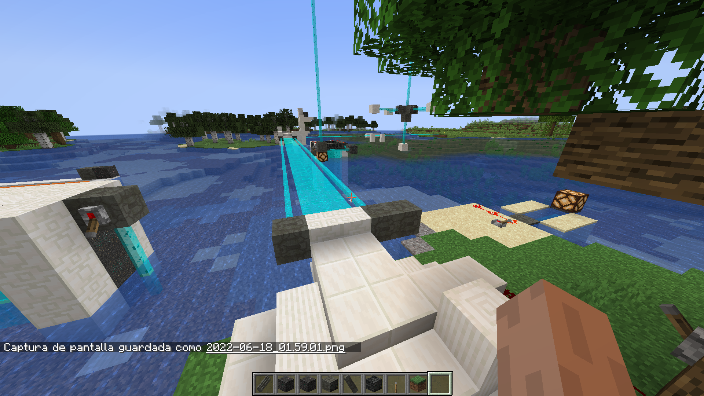
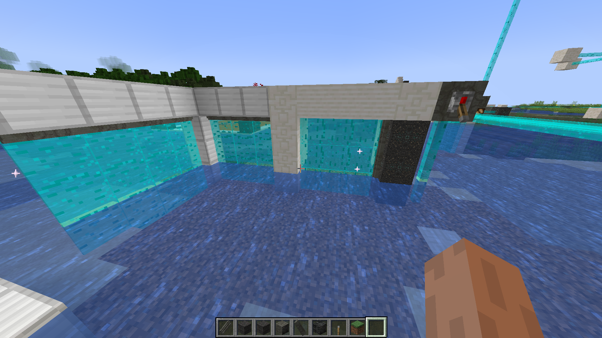
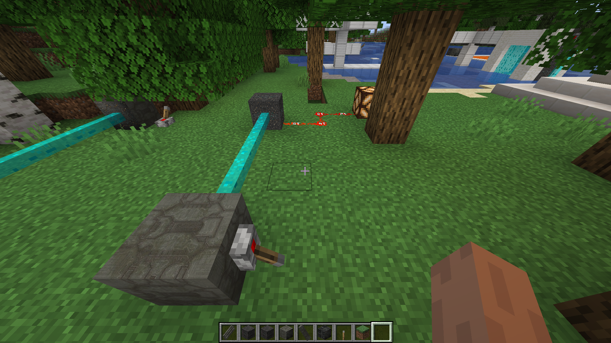
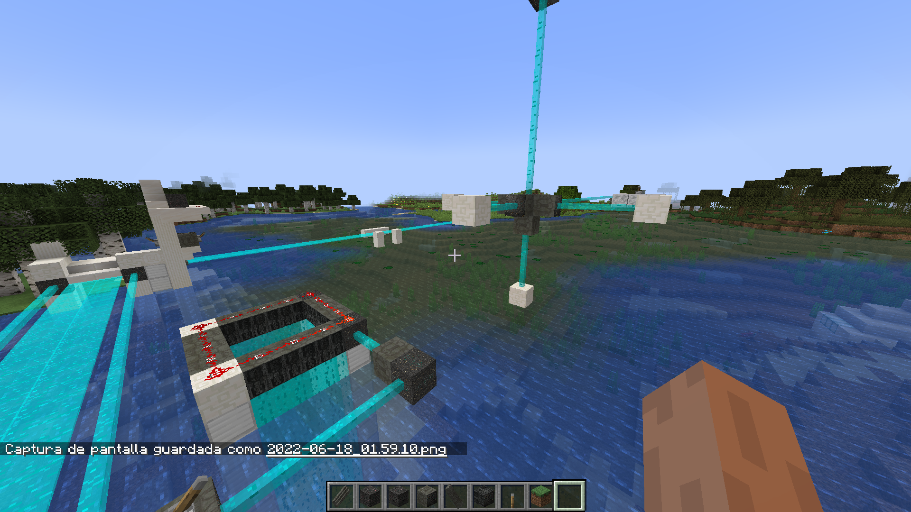

# Forerunner Bridges and Barriers

[English](README.md) | **Español**

> Tecnología de luz dura inspirada en Halo para Minecraft: puentes de luz controlados con redstone, barreras que detienen el agua pero no a ti, y haces de luz que transportan señales de redstone, incluso bajo el agua.

*▶ Haz clic en la imagen para ver la presentación en YouTube.*

## Qué agrega

Forerunner Bridges and Barriers retoma las ideas del clásico mod *Light Bridges and Doors* y va más allá, con dispositivos inspirados en la tecnología Forerunner de la saga Halo. Cada dispositivo es un **emisor**: aliméntalo con redstone y proyectará luz hasta **40 bloques** en la dirección hacia la que apunta. Corta la señal y la luz se retrae.

### Luz dura

- **Puente de luz dura.** Una plataforma delgada de luz sólida sobre la que puedes caminar, proyectada por el *Emisor de puente de luz dura*.
- **Barrera de luz dura.** Una pared delgada de luz sólida que detiene a jugadores y criaturas, proyectada por el *Emisor de barrera de luz dura*.

### Barrera de luz blanda

El *Emisor de barrera de luz blanda* proyecta una barrera de fase inteligente: jugadores y criaturas la atraviesan sin problema, pero el agua, la lava y cualquier otro fluido no. Úsala para túneles bajo el agua, para contener lava o para sellar una piscina por la que puedes entrar y salir caminando.

### Redstone a larga distancia

Alimenta un *Emisor de energía luminosa* con redstone y proyectará un haz de energía luminosa. Mientras el haz toque un *Receptor de energía luminosa*, el receptor emitirá una señal de redstone a máxima potencia (15). Funciona bajo el agua y sin polvo de redstone de por medio.

## Cómo se comporta la luz

- **Controlada con redstone.** Los emisores se encienden con una señal de redstone y retraen su luz cuando la señal se corta.
- **En cualquier dirección.** Los emisores pueden apuntar en cualquiera de las seis direcciones, así que la luz también puede ir en vertical.
- **Los obstáculos detienen la luz sin destruirse.** La luz solo ocupa espacio vacío: aire, agua, lava y plantas reemplazables como el pasto. Se detiene ante cualquier otra cosa y vuelve a crecer sola cuando el camino queda libre.
- **La luz más fuerte corta a la más débil.** La luz dura (puentes y barreras duras) atraviesa las barreras de luz blanda y los haces de energía luminosa; las barreras de luz blanda atraviesan los haces de energía luminosa. Cuando la luz más fuerte se apaga, la que cortó vuelve a crecer. Las luces de igual fuerza se bloquean entre sí.
- **Amigable con el agua.** Los puentes, las barreras duras y los haces de energía luminosa conservan el agua del espacio que ocupan, así que colocarlos o quitarlos bajo el agua nunca deja bolsas de aire. Las barreras de luz blanda sacan el agua: para eso existen.
- **Visibles desde dentro.** Las barreras de luz blanda y los haces de energía luminosa se dibujan por ambos lados, así que se siguen viendo aunque estés dentro de uno.
- **Luminosas y permanentes.** Todas las luces iluminan. No se pueden minar: apaga el emisor para quitarlas. La energía luminosa es la excepción: coloca un bloque en su camino y el haz se corta, igual que al tapar una luz real. Los emisores y el receptor se minan con pico.

## Fabricación

Usa [JEI](https://github.com/mezz/JustEnoughItems) o un mod similar para ver la forma exacta de cada receta. Ingredientes:

| Objeto | Cantidad | Ingredientes |
|---|---|---|
| Emisor de puente de luz dura | 4 | Diamante, fragmento de amatista, piedra luminosa, lingote de hierro, polvo de redstone, repetidor de redstone |
| Emisor de barrera de luz dura | 1 | Emisor de puente de luz dura (los dos emisores se convierten entre sí) |
| Emisor de barrera de luz blanda | 3 | Prismarina, vidrio, fragmento de amatista, lingote de hierro, polvo de redstone, repetidor de redstone |
| Emisor de energía luminosa | 2 | Vidrio, fragmento de amatista, lingote de oro, lingote de hierro, repetidor de redstone |
| Receptor de energía luminosa | 2 | Sensor de luz solar, comparador de redstone, lingote de oro, lingote de hierro, repetidor de redstone |

Todos los emisores y el receptor están en la pestaña creativa *Forerunner Tech*.

## Galería

*Un puente de luz dura cruzando un río.*

*Barreras de luz dura formando paredes.*

*Emisores de energía luminosa, encendidos con palancas, envían su señal a un receptor que alimenta una lámpara de redstone.*

*Haces de energía luminosa llevando señales de redstone en varias direcciones, incluso hacia arriba.*

## Versiones

| Minecraft | Cargador de mods | Estado |
|---|---|---|
| 26.1.2 | NeoForge | Versión actual |
| 1.19.2 | Forge | Versión anterior |
| 1.18.2 | Forge | Versión anterior |

La versión para 1.19.2 también permite usar los *diamantes industriales* de IC2 Classic en las recetas. IC2 Classic solo está disponible hasta Minecraft 1.19.2, así que esa compatibilidad no forma parte del port a 26.1.2; volverá si IC2 Classic se actualiza.

Idiomas: inglés y español (España, México y Argentina).

## Para desarrolladores

El mod está hecho con [MCreator](https://mcreator.net). Abre `forerunner_bridges_and_barriers.mcreator` en MCreator 2026.2 con el generador de NeoForge 26.1.2.

- **Alcance.** Cada bloque de luz tiene la propiedad de estado `lightpower` (entero de 0 a 40, valor por defecto 1), definida en MCreator en las propiedades personalizadas del bloque. El emisor coloca la primera luz con `lightpower` 40 y cada luz coloca la siguiente con uno menos, así que el valor es el alcance restante. El alcance viene de la variable global `lightBridgeMaxLength`; si la cambias, cambia también el máximo de la propiedad.
- **Agregar un nuevo tipo de luz.** Dale al bloque la propiedad `lightpower` como se describe arriba y agrégalo al procedimiento `LightRank` con su fuerza. `OnEmitterBlockUpdate` y `OnEmittedBlockUpdate` usan `LightRank` para decidir qué puede cortar cada luz.
- **Código bloqueado.** Solo el elemento `FluidBarrier` conserva código bloqueado: agrega `.forceSolidOn()` a las propiedades del bloque para que los fluidos no puedan entrar ni destruir la barrera de luz blanda, una opción que MCreator no expone. Al actualizar MCreator, desbloquea el elemento, regenera el código, vuelve a agregar `.forceSolidOn()` justo después de `.noCollision()` y bloquéalo de nuevo.

## Créditos

Creado por Arturo Enrique Rosas Gutiérrez (**AEROGU**, RGMods).

Inspirado en el mod *Light Bridges and Doors* y en la tecnología Forerunner de la saga Halo.

## Licencia

Todos los derechos reservados. © 2022-2026 Arturo Enrique Rosas Gutiérrez (AEROGU).

Puedes descargar el mod desde sus páginas oficiales y jugar con él. Copiarlo, modificarlo, redistribuirlo o volver a subirlo requiere permiso del autor. El código fuente es público para que se pueda leer y estudiar; consulta [LICENSE](LICENSE).

*Halo es una marca registrada de Microsoft. Este mod no está afiliado ni respaldado por Microsoft ni por Halo Studios. No es un producto oficial de Minecraft; no está aprobado por Mojang ni por Microsoft, ni asociado con ellos.*
